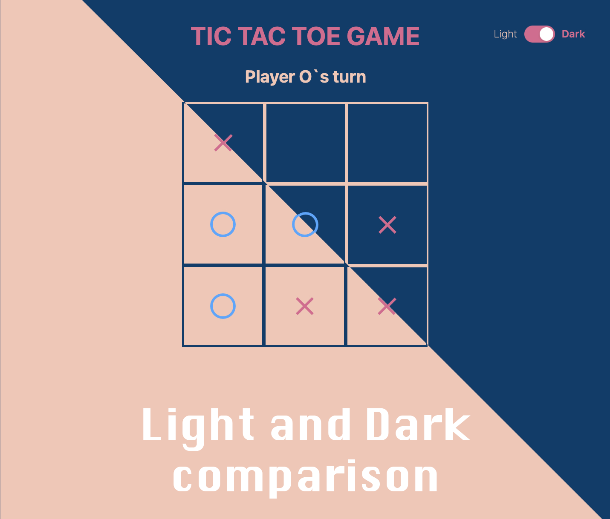

# TicTacToe Game
> A classic game created using a stack of Vue+Vite and Tailwind for implementing a Light/Dark UI option and neat CSS, overall.
> Live demo [_here_](hvue-vite-tictactoe.vercel.app). <!-- If you have the project hosted somewhere, include the link here. -->

## Screenshots

<!-- If you have screenshots you'd like to share, include them here. -->

## Table of Contents
* [General Info](#general-information)
* [Technologies Used](#technologies-used)
* [Features](#features)
* [Screenshots](#screenshots)
* [Setup](#setup)
* [Usage](#usage)
* [Project Status](#project-status)
* [Room for Improvement](#room-for-improvement)
* [Contact](#contact)
<!-- * [License](#license) -->


## General Information
- A TicTacToe game that implements
- The whole reason and purpose for undertaking such project, was purely to learn some new features (i.e Light/Dark UI toggle) and get myself familliar with awesome CSS framework such as - **Tailwind**
<!-- You don't have to answer all the questions - just the ones relevant to your project. -->


## Technologies Used
- **Vue 3**    - version 3.2.25
- **Vite**     - version 2.8.0
- **Tailwind** - version 3.0


## Features
List the ready features here:
- Polished hoover effects and animations
- Light/Dark UI toggle switch with smooth color transitions
- A choice to pick which player(sign) starts first


## Setup
What are the project requirements/dependencies? Where are they listed? A requirements.txt or a Pipfile.lock file perhaps? Where is it located?

Proceed to describe how to install / setup one's local environment / get started with the project.


## Usage
How does one go about using it?
Provide various use cases and code examples here.

`write-your-code-here`


## Project Status
Project is: 
```diff
+ COMPLETED
```

_However, I still believe there are some room for improvement. But I am intending to move along to the bigger project in order to complete a harder tasks._


## Room for Improvement
Include areas you believe need improvement / could be improved. Also add TODOs for future development.

Room for improvement:
- Complete an JS algorith for DRAW outcomes
- Create a WIN/LOSE record for every player in one session
- Add some new variations of the TicTacToe game and add an option to choose between them

## Contact
Created by [@flynerdpl](https://www.flynerd.pl/) - feel free to contact me!


<!-- Optional -->
<!-- ## License -->
<!-- This project is open source and available under the [... License](). -->

<!-- You don't have to include all sections - just the one's relevant to your project -->
